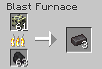

# End Stone Netherite Ore

End Stone Netherite Ore is a variant of the netherite ore family and can be found in the end. The block itself can be obtained by mining the block with a silk touch pickaxe at diamond or higher tier.

## LootTables

| Drops | Quantity | Method |
| ----- | -------- | ------ |
| [Raw Netherite](../../items/raw_netherite.md) | Between 1 & 3 | Fortune or just normal mining
| [End Stone Netherite ore](./end_stone_netherite_ore.md) | 1 | Silk touch

## Recipe(s)

