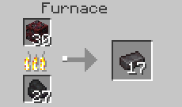
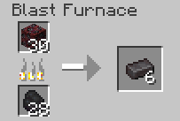

# Netherite Ore

Netherite ore is the replacement for Ancient Debris in the Nether. It can be found between Y = 8 and Y = 16. The block itself can be obtained by using a silk touch pickaxe at diamond or higher tier.

## LootTables

| Drops | Quantity | Method |
| ----- | -------- | ------ |
| [Raw Netherite](../../items/raw_netherite.md) | Between 1 & 3 | Fortune or just normal mining
| [Deepslate Netherite ore](netherite_ore.md) | 1 | Silk touch

## Recipe(s)

