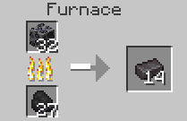
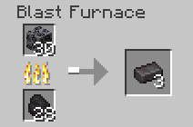

# Stone Netherite Ore

Deepslate Netherite Ore is a variant of the netherite ore family and is found in the stone level in the overworld. The block itself can be obtained by mining it with a pickaxe enchanted with silk touch at diamond or higher tier.

## LootTables

| Drops | Quantity | Method |
| ----- | -------- | ------ |
| [Raw Netherite](../../items/raw_netherite.md) | Between 1 & 3 | Fortune or just normal mining
| [Stone Netherite ore](stone_netherite_ore.md) | 1 | Silk touch

## Recipe(s)

