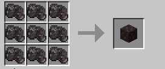

# Raw Netherite Block

## Description

The Raw Netherite Block is a block created by compacting [Raw Netherite](../items/raw_netherite.md) into a dense form of Raw Netherite. Think of the block as a Raw Iron or Raw Gold block except it is only available by crafting!

## LootTables

| Drops | Quantity |
| ----- | -------- |
| Raw Netherite Block | 1 |

## Recipe(s)

